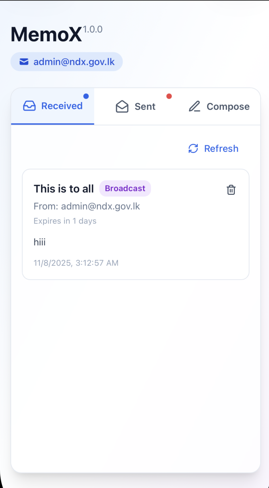

# Memo App

<p align="center">
  
</p>
This folder contains the Memo microapp: a small app for composing, sending and viewing memos. The microapp is split into two main parts:

- `backend/` — Go service exposing a small REST API
- `frontend/` — React + TypeScript client that uses a microapp bridge for persistence and identity

This README is a short landing page. See `frontend/README.md` and `backend/README.md` for per-component details and run instructions.

## Highlights

- Polling-based sync
- TTL semantics: empty TTL defaults to 1 day; `null`/omitted TTL means "keep forever"
- Memo submission handled in `useMemos` hook (frontend)
- Pagination: simple page+limit support for lists
- Bridge integration for storing received memos (`window.microAppBridge`)

## Run

Start backend:

```bash
cd backend
go mod download
go run .
```

Start frontend:

```bash
cd frontend
npm install
npm run dev
```

See `frontend/README.md` and `backend/README.md` for more details.

## Where to look in the code

- Frontend: `frontend/src/hooks/useMemos.ts`, `frontend/src/components/MemoForm.tsx`, `frontend/src/api.ts`, `frontend/src/constants.ts`
- Backend: `backend/handlers.go`, `backend/models.go`, `backend/constants.go`, `backend/auth.go`
